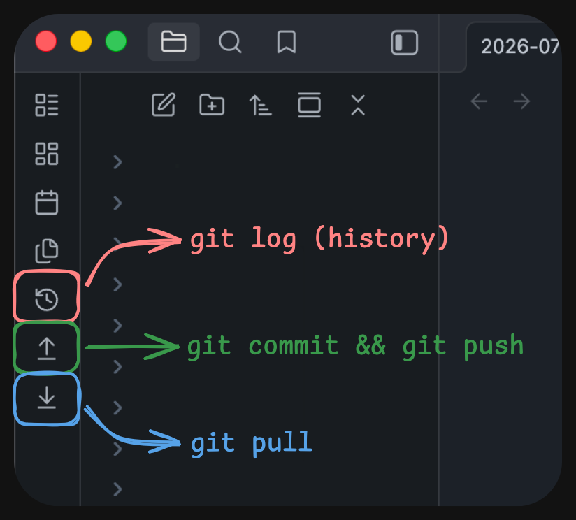

# Git Ribbon Sync

A lightweight, seamless Obsidian plugin that adds dedicated Git action buttons directly to your left sidebar ribbon. Easily pull, commit, push, and inspect your repository's commit history without ever opening a terminal.



---

## Ribbon Icons & Usage

The plugin adds three buttons to your left ribbon bar:

| Icon | Command | Description |
| :---: | :--- | :--- |
| **`history`** | **Show Git History** | Opens an interactive tab inside Obsidian rendering your repository's commit log in a styled table. |
| **`arrow-down-to-line`** | **Git Pull** | Executes `git pull` in your vault root and displays a status notification upon completion. |
| **`arrow-up-from-line`** | **Git Commit & Push** | Stages files, commits with a message like `Vault sync: mac 2026-07-28 14:30:00`, and pushes to your remote repo. |

---

## Settings

Navigate to **Settings → Community Plugins → Git Ribbon Sync** to configure:

* **Device Name:** Customize the identifier included in automated commit messages (defaults to your machine's OS or hostname).
* **Commit Message Prefix:** Modify the leading text for automated sync commits (default: `Vault sync:`).

---

## Command Palette & Hotkeys

All three ribbon actions are registered as official Obsidian commands:

1. Open the Command Palette.
2. Search for:
   - `Git Ribbon Sync: Git Pull`
   - `Git Ribbon Sync: Git Commit & Push`
   - `Git Ribbon Sync: Show Git Commit History`
3. Assign custom keyboard shortcuts under **Settings → Hotkeys**.

---

## Development & Building

To modify or build the plugin locally:

```bash
# Install dependencies
npm install

# Run watch mode (auto-compiles on save and copies to your vault)
npm run dev

# Single build for release
npm run build
```
